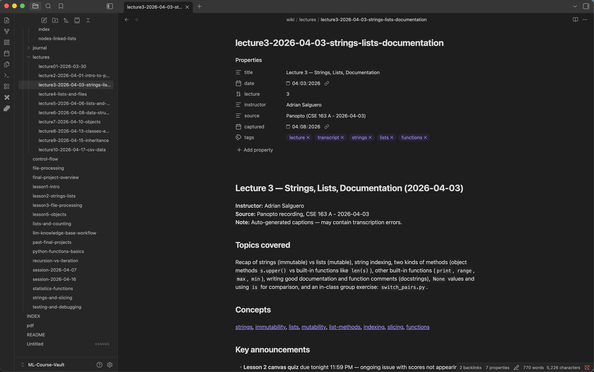
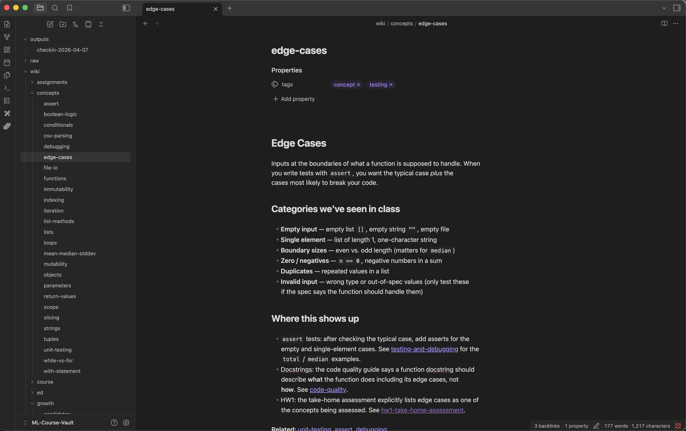
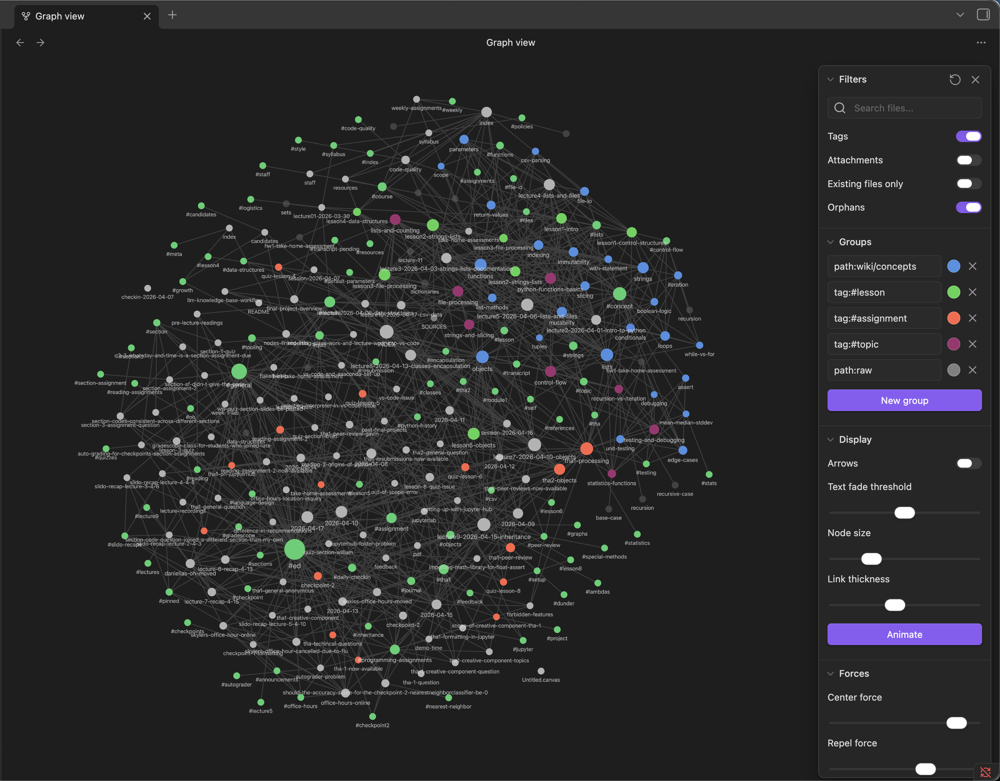
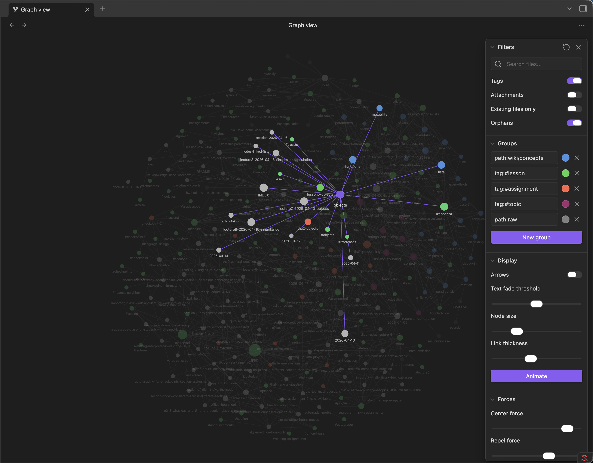
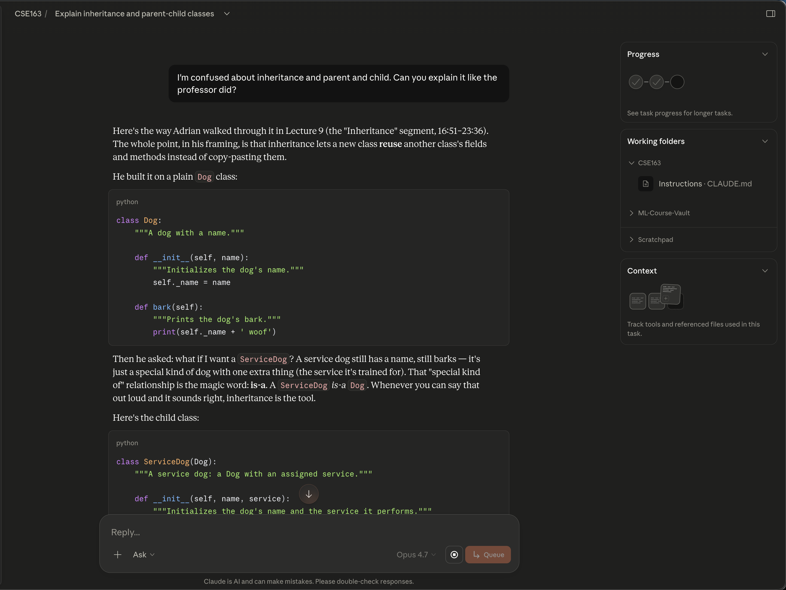
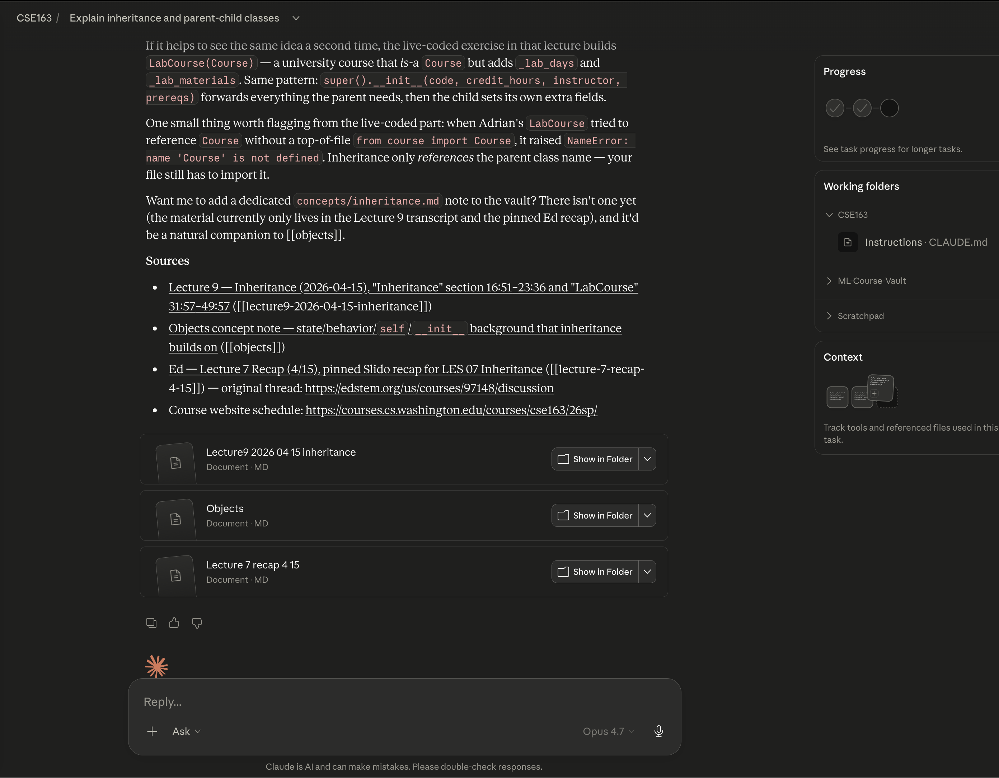

# Lecture Note [VAULT]

*Lecture notes use structured frontmatter (date, instructor, source, tags) and link out to concept notes. Every idea in the "Concepts" section is a wikilink, turning each lecture into an entry point into the wider VAULT.*  

 
 

# Concept Note [VAULT]

*Concept notes are the atoms of the VAULT. Each defines a single idea with real examples from class, notes where it shows up (assert tests, docstrings, HW1), and surfaces backlinks so every note is reachable from multiple directions.*  

 
 

# Knowledge Graph [VAULT]

*151 concept notes, 486 wikilinks, color-coded: concepts (blue), lectures (green), assignments (orange), topics (purple), raw sources (gray). The clustering emerges from how the content actually connects. Isolated nodes flag gaps in my understanding.*  

 
 

# Zoomed-In Knowledge Graph [VAULT]

*Zooming in on a single node (`objects`) reveals its local neighborhood: the lecture where it's introduced, the concepts it depends on (mutability, functions, lists, classes, self), the assignment built on it (tha2-objects), and the later lecture that extends it (inheritance). This is what "explore before answering" visually looks like.*  

 
 

# Claude Prompt [VAULT + [CLAUDE.md](../CLAUDE.md)]

*A cold prompt — no prior context — and the AI re-teaches inheritance using the professor's own framing (`Dog → ServiceDog`, "is-a"), not a generic internet explanation. Code follows the style rules in [CLAUDE.md](../CLAUDE.md) (PEP 8, snake_case, docstrings) — guardrails that keep the AI aligned with how the course actually teaches.* 

*Used an ambiguous prompt to showcase how AI is able to scope to precisely the course material*  

 
 

# Claude Prompt (ending) [VAULT + [CLAUDE.md](../CLAUDE.md)]

*The end of that same response. Every answer closes with a Sources block combining lecture timestamps, concept notes, Ed threads, and course-website URLs — each in the dual-link format so the same citation works in both Claude chat and inside Obsidian. When a note doesn't exist yet, the AI proposes creating it rather than inventing a path.*  

